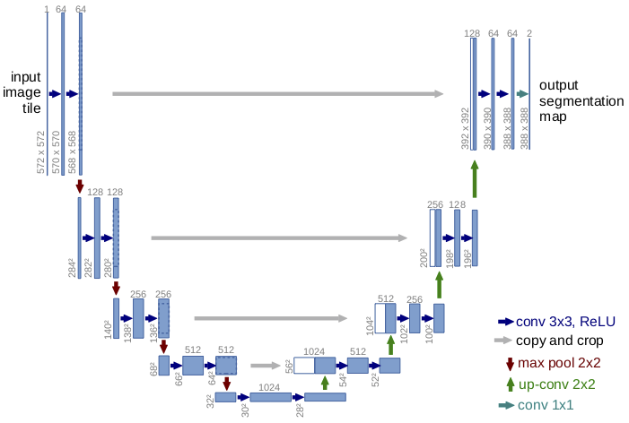

# UNet

[UNET](https://arxiv.org/abs/1505.04597) was developed by Olaf Ronneberger, Philipp Fischer, and Thomas Brox for medical image segmentation.
The original paper presents the following architecture 

## References

- [Understanding Semantic Segmentation with UNET](https://towardsdatascience.com/understanding-semantic-segmentation-with-unet-6be4f42d4b47)
- [U-Net For Segmenting Seismic Images With Keras](https://www.depends-on-the-definition.com/unet-keras-segmenting-images/)
- [Up-sampling with Transposed Convolution](https://towardsdatascience.com/up-sampling-with-transposed-convolution-9ae4f2df52d0)
